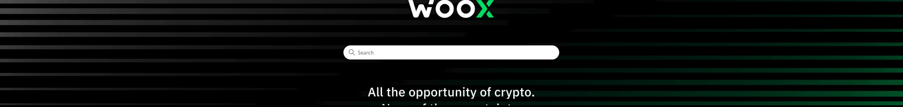

export function openSearch() {
  document.getElementById("search-bar-entry").click();
}

  

    
  

  

    

      Woo Documentation
    

    

      What can we help you build?
    

    <button
      type="button"
      className="mx-auto w-full flex items-center text-sm leading-6 shadow-sm text-gray-400 bg-white ring-1 ring-gray-400/20 focus:outline-primary"
      id="home-search-entry"
      style={{
        maxWidth: '24rem',
        borderRadius: '4px',
        marginTop: '3rem',
        paddingLeft: '0.75rem',
        paddingRight: '0.75rem',
        paddingTop: '0.75rem',
        paddingBottom: '0.75rem',
      }}
      onClick={openSearch}
    >
      <svg
        className="h-4 w-4 ml-1.5 mr-3 flex-none bg-gray-500 hover:bg-gray-600 dark:bg-white/50 dark:hover:bg-white/70"
        style={{
          maskImage:
            'url("images/home_banner.jpg")',
          maskRepeat: 'no-repeat',
          maskPosition: 'center center',
        }}
      />
      Start a chat with us...
    </button>
  

  Choose a topic below

<CardGroup cols={3}>
  <Card title="Guides" icon="book-open" href="/introduction">
    About Woo Network.
  </Card>
  <Card title="Reference" icon="code-simple" href="/api-reference">
    Comprehensive details about the Woo API.
  </Card>
  <Card title="Releases" icon="party-horn" href="/changelog">
    News about features and changes in Woo.
  </Card>
</CardGroup>

